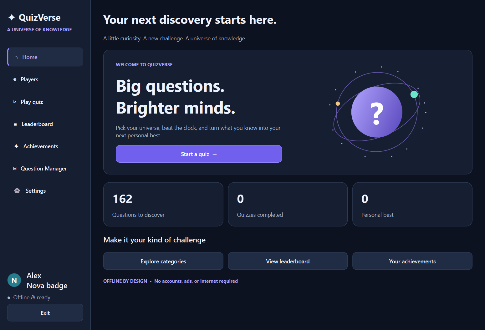
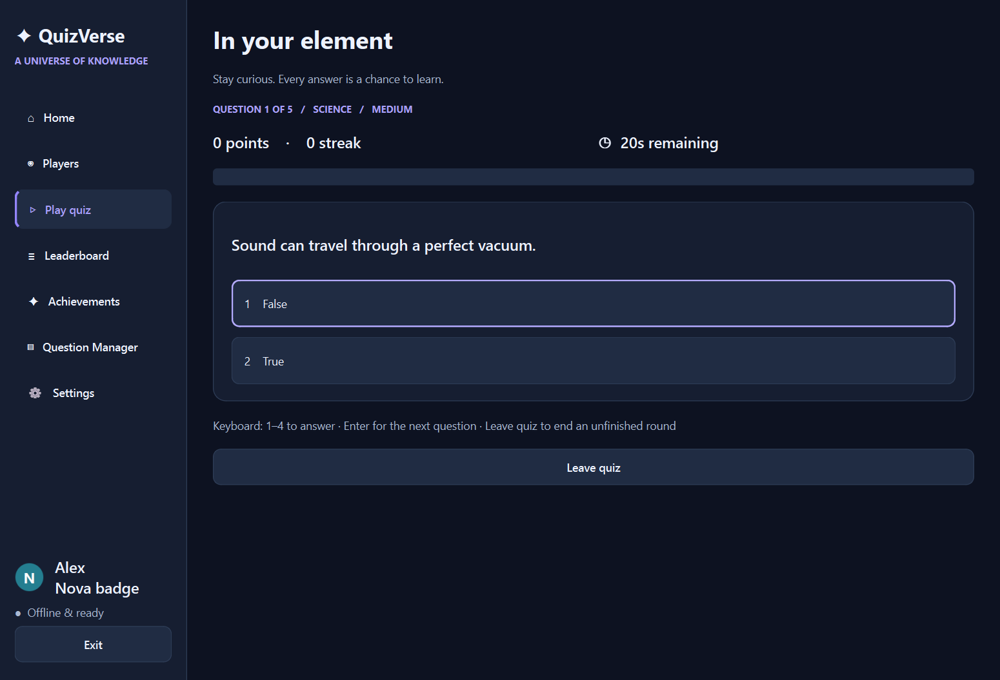
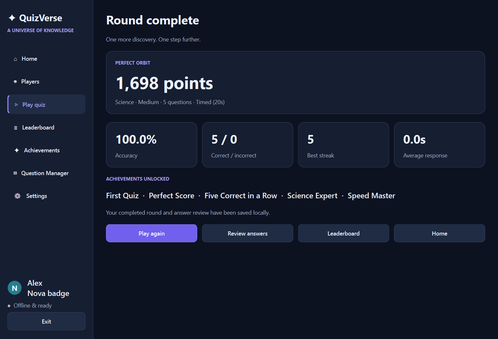
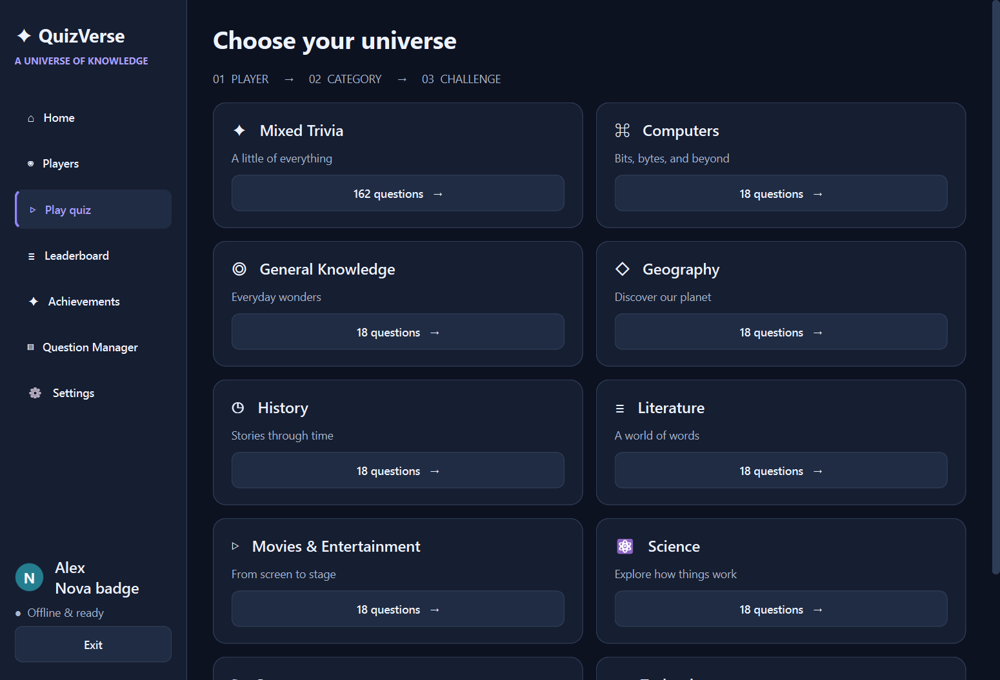
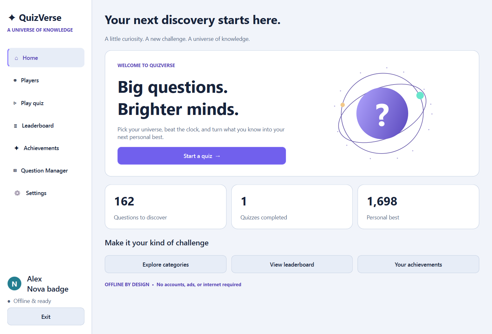

# QuizVerse

[](https://github.com/TalhaBytes/QuizVerse/actions/workflows/tests.yml)


**A universe of knowledge, right on your desktop.**

QuizVerse is an offline Windows trivia game built with Python 3.12, PySide6, and SQLite. Choose a player, explore a subject, set your challenge, and earn points through accuracy, speed, and streaks. Every completed round includes an explanation-rich answer review.

## Download

Windows users can download the latest ready-to-run version from the
[latest QuizVerse release](https://github.com/TalhaBytes/QuizVerse/releases/latest).

No Python installation is required for the packaged Windows version.



## Features

- Native desktop interface with dark/light themes, keyboard navigation, rounded cards, and scalable artwork.
- Player profiles with six colored avatar badges, editable names, statistics, and personal achievements.
- **162 starter questions**: nine subjects × three difficulties × six questions, including multiple-choice and true/false formats.
- **10 category choices**: General Knowledge, Science, Technology, Computers, History, Geography, Sports, Movies & Entertainment, Literature, and Mixed Trivia.
- Random questions without repeats within a round, plus shuffled answer choices.
- Rounds of 1–50 questions, limited to the number available in the chosen subject and difficulty.
- Configurable countdowns, untimed practice, immediate feedback, explanations, and progress indicators.
- Difficulty multipliers, speed bonuses, streak bonuses, performance ratings, and detailed results.
- Persistent local leaderboard with category, difficulty, timing-mode, and round-length filters; saved answer reviews.
- Ten automatically unlocked achievements, including subject expertise, streaks, speed, and cumulative progress.
- Validated Question Manager with add/edit/delete, search, filters, and custom categories.
- Optional synthesized sound effects and ambient music using Qt Multimedia.
- Safe interruption/exit confirmations, per-player statistics reset, and automatic database initialization.

## Install and run

Use **64-bit Python 3.12** on Windows 10 or 11. From this repository's root in PowerShell:

```powershell
py -3.12 -m venv .venv
.\.venv\Scripts\python.exe -m pip install -r requirements.txt
.\.venv\Scripts\python.exe main.py
```

Alternatively, activate the environment and run:

```powershell
python main.py
```

Internet access is needed only to download development dependencies. All game functionality works offline. No account, API key, or service is required.

The prebuilt Windows distribution can be run by extracting the entire archive and opening `QuizVerse/QuizVerse.exe`. Keep its `_internal` folder beside the executable. Python is not required for this version.

## Play

1. Select **Start a quiz**, then create or select a player.
2. Continue to categories and choose a subject or Mixed Trivia.
3. Set Easy, Medium, or Hard and the number of questions.
4. Answer with the mouse or keys **1–4**. Read the feedback, then select Next or press **Enter**.
5. View results, review every answer, replay, or compare saved rounds on the leaderboard.

Select **Settings → Save settings** to apply changes. Defaults are five questions, dark theme, sound effects on, music off, and timed play: Easy 30 seconds, Medium 20, Hard 15. Timers accept 5–120 seconds. The countdown continues while an interruption confirmation is open and while the app is unfocused. The feedback screen has no countdown.

Finishing the final answer immediately saves the round. An unfinished round is discarded if you confirm leaving or close the process; partial rounds never affect statistics. Completed rounds survive restarts. Select a player again after restarting.

### Scoring

For each correct answer:

```text
m = 1 (Easy), 2 (Medium), or 3 (Hard)
base   = 100 × m
speed  = floor(50 × m × remaining_time / time_limit)  [timed only]
streak = 10 × m × min(consecutive_correct_answers − 1, 10)
points = base + speed + streak
```

Wrong or expired answers score zero and reset the current streak. Expiration counts as an incorrect answer and contributes the full time limit to average response time. Untimed rounds receive no speed bonus. Accuracy/percentage is `correct ÷ total × 100`, not a percentage of possible points.

Ratings: 100% **Perfect orbit**, 80–99% **Stellar work**, 60–79% **Rising star**, below 60% **Keep exploring**. Leaderboards rank the top 100 completed rounds by points, then accuracy, then lower average response time. Round length and timer configuration influence points; use the filters and Timer column to compare similar rounds.

### Achievements

| Achievement | Requirement |
| --- | --- |
| First Quiz | Complete any round |
| Perfect Score | 100% in a round of at least 5 questions |
| Five / Ten Correct in a Row | Streak of 5 / 10 in one round |
| Science / History / Technology Expert | At least 80% in the named category with at least 5 questions |
| Speed Master | Perfect timed round of at least 5, average response ≤5s, timer ≤30s |
| Hard Mode Champion | At least 80% on Hard with at least 5 questions |
| 100 Questions Answered | Complete at least 100 questions across saved rounds |

Subject expertise requires choosing that category; Mixed Trivia does not count toward subject awards. The starter bank supports six questions per subject/difficulty, so a ten-answer streak requires Mixed Trivia or an expanded bank.

## Screenshots

These are actual native Qt captures using temporary demonstration profiles and automated quiz answers, not design mockups. Demo data is not included in the user database.

| Quiz | Results |
| --- | --- |
|  |  |

| Categories | Light appearance |
| --- | --- |
|  |  |

## Project structure

```text
QuizVerse/
├── main.py                  # Startup and application-level error reporting
├── requirements.txt         # Runtime dependency
├── requirements-dev.txt     # Packaging tools
├── QuizVerse.spec           # Windows PyInstaller configuration
├── assets/                  # Original icons, screenshots, synthesized audio
├── data/questions.json      # Expandable, validated starter bank
├── database/store.py        # Schema, initialization, question persistence
├── models/question.py       # Question model and validation
├── services/                # Quiz, scoring, players, results, awards, settings, audio
├── ui/                      # Main window, screens, components, centralized theme
├── utils/paths.py           # Development/frozen resource and user-data paths
├── tests/                   # unittest services and Qt interaction tests
├── tools/build_assets.py    # Rebuild original sound files and ICO
└── .github/workflows/       # Windows CI tests
```

One `QMainWindow` hosts a `QStackedWidget`. The Question Manager and profile editors use focused modal dialogs; navigation stays in the main window. Domain scoring and game state are independent of UI widgets.

## Database and question editing

The app creates `%LOCALAPPDATA%\QuizVerse\quizverse.db` on first launch. Data is kept outside the installation directory. `QUIZVERSE_DATA_DIR` can override this location for testing or portable data storage. Close the app before copying the database for backup.

Tables: `players`, `questions`, `quiz_results`, `quiz_answers`, `achievements`, `player_achievements`, and `settings`. Foreign keys are enabled, child records cascade when a player/result is deleted, and results plus awards are committed in one transaction. A unique session key prevents duplicate result saves. Statistics are calculated from saved results, avoiding divergent counters.

Saved answers contain question/choice/explanation snapshots, so editing or deleting a question does not alter past reviews. Duplicate player names and question text are rejected after normalization. Invalid question records are skipped and logged. Invalid stored settings fall back to defaults. Startup errors are reported without replacing an existing database; unexpected errors are logged to rotating `quizverse.log` files beside it.

Use Question Manager for changes to an existing installation. You can type a new category in the editor. Multiple-choice questions require four distinct answers; true/false questions have two fixed choices. All questions require a correct choice and explanation. Text is treated as plain text.

To expand the starter bank for new installations, edit `data/questions.json` using the existing record format. The bank is seeded **once**, not re-imported at every launch; deleting all questions does not silently restore them. Existing installations should use Question Manager. Mixed Trivia is a combined selection, not a stored question category.

## Test

```powershell
python -m unittest discover -s tests -v
```

The suite uses temporary databases and does not modify real player data. Service tests cover scoring, randomization, timeouts, validation, statistics, achievements, transactional rollback, resets, and restarts. Qt tests cover navigation, a complete mouse-driven round, reviews, editors, settings, empty data, and interrupted quizzes. Tests default to Qt's offscreen platform; visual screenshots were checked separately with the native Windows platform.

See [TESTING.md](TESTING.md) for the verified environment and manual acceptance checks.

## Package for Windows

Build on Windows using the architecture you intend to distribute:

```powershell
python -m pip install -r requirements-dev.txt
python -m PyInstaller --clean QuizVerse.spec
```

Run `dist\QuizVerse\QuizVerse.exe`. Distribute the **entire** `dist\QuizVerse` directory, including `_internal`. The spec includes the question bank, icons, and sounds and keeps user data outside the bundle. Qt, Python, and SQLite runtime components are collected by PyInstaller. Source screenshots are excluded from the executable bundle.

This is a portable folder build, not an installer. The executable is unsigned. Test releases on a clean target Windows machine before public distribution. Dependency notices are listed in [THIRD_PARTY.md](THIRD_PARTY.md).

## Current boundaries and future improvements

- Local, single-device play; no online multiplayer or cloud synchronization.
- Unfinished rounds are intentionally not resumable after exit.
- Six starter questions per subject/difficulty; add questions or choose Mixed Trivia for longer rounds.
- Minimum window size is 980 × 700 logical pixels; pages scroll on compact displays. Tables can scroll horizontally.
- Sound output depends on the available audio device. Missing optional audio files do not prevent play.
- Future work: question-pack import/export, localization, resumable rounds, a larger reviewed bank, and a signed installer.

## License

QuizVerse source code and original artwork/audio are provided under the [MIT License](LICENSE). Third-party components retain their own licenses.
